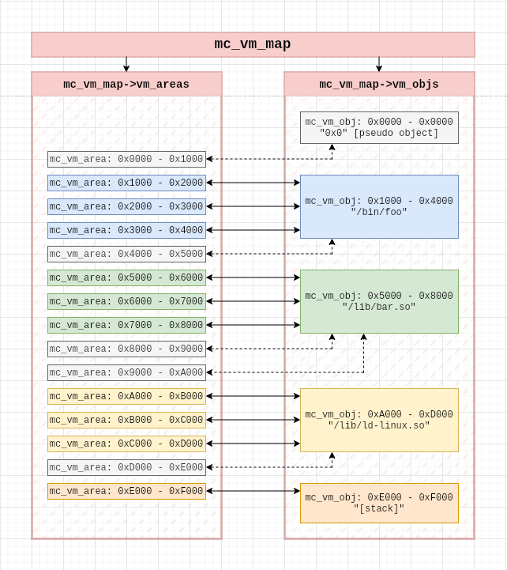

# Memcry

<p align="center">
    
</p>


### ABOUT:

**The Memcry Library () provides**:

- Graph-like data structure (*map*) for representing the memory map of a target process.
- The ability to update the *map* as the target's memory mappings change without invalidating pointers to the *map*.
- Tracking of (assumed) ownership of unnamed `vm_area`s.
- Support for **multiple interfaces** for acquiring the memory maps, reading and writing memory.
- Multiple convenient utilities.

<p align="center">
    
</p>

See the example below. Feel free to contact me on discord (*@vykt*), email (*vykt[at]disroot[dot]org*).


### DEPENDENCIES:

If you're not using a packaged release, you'll need to install:

- [CMore](https://github.com/vykt/cmore) - Data structures for C.


### EXAMPLE:

```c
#include <stdio.h>
#include <stdint.h>
#include <unistd.h>

#include <memcry.h>
#include <cmore.h>


int main() {

	int ret;
	

	/*
	 *  First, find the PID of the target based on the target's name. You can
	 *  optionally pass a pointer to an uninitialised CMore vector if you want
   *  to find PIDs of multiple processes with the same name.
	 */
	pid_t pid;
	pid = mc_pid_by_name("target_name", NULL);


	/*
	 *  Open a session on your target. For the procfs interface, this will
	 *  open file descriptors on /proc/pid/{mem,maps}
	 */
	 mc_session s;
	 ret = mc_open(&s, PROCFS, pid);
	 if (ret != 0) {
		 /* on error, a perror() function is provided */
		 mc_perror("[error]");
	 }


	/*
	 *  Read the target's memory map for the first time.
	 */
	mc_vm_map m;
	ret = mc_update_map(&s, &m);


	/*
	 *  Find the "libfoo.so" object in the target.
	 */
	cm_lst_node * libfoo_node = NULL;
	libfoo_node = mc_get_obj_node_by_basename(&m, "libfoo.so");
	if (libfoo_node == NULL) {/*...*/}


	/*
	 *  Print libfoo.so's starting address.
	 */
	mc_vm_obj * libfoo_obj = MC_GET_NODE_OBJ(libfoo_node);
	printf("libfoo.so start addr: 0x%lx, end addr: 0x%lx\n", 
	       libfoo_obj->start_addr, libfoo_obj->end_addr);


	/*
	 *  Print the full path of the object after libfoo.so.
	 */
	cm_lst_node * next_node = libfoo_node->next;
	mc_vm_obj * next_obj = MC_GET_NODE_OBJ(next_node);
	printf("after libfoo.so: %s\n", next_obj->pathname);


	/*
	 *  Get the first area of libfoo.so. The object of libfoo (libfoo_obj)
	 *  stores pointers to area nodes. 
	 */
	cm_lst_node * area_node_p = libfoo_obj->vm_area_node_ps.head;
	cm_lst_node * area_node = MC_GET_NODE_PTR(area_node_p);
	mc_vm_area * area = MC_GET_NODE_AREA(area_node);
	printf("is first area writable?: %d\n, area->access & MC_ACCESS_WRITE);


	/*
	 *  Get the next area and print its address range.
	 */
	mc_vm_area * next_area = MC_GET_NODE_AREA(area_node->next);
	printf("next area start addr: 0x%lx, end addr: 0x%lx\n",
	       next_area->start_addr, next_area->end_addr);


	/*
	 *  The target's (OS-wide) memory map may have been updated; we should update
   *  our local map.
	 */
	ret = mc_update_map(&s, &m);
	if (ret != 0) {/*...*/}


	/*
	 *  Check if libfoo.so is still mapped. If not, fetch the next mapped 
	 *  object. Even if libfoo.so and its constituent areas have been unmapped, 
	 *  their nodes and object pointers will remain valid.
	 */
	cm_lst_node * iter_node;
	mc_vm_obj * iter_obj;
	if (libfoo_obj->mapped == false) {
		iter_node = libfoo_node->next;
		while (iter_node != m.vm_objs.head) {
			iter_obj = MC_GET_NODE_OBJ(iter_node);
			if (iter_obj->mapped == true) break;
		}
	}


	/*
	 *  Clean up unmapped objects & areas. This will cause `libfoo_node` and
	 *  `libfoo_obj` pointers to become invalid.
	 */
	ret = mc_map_clean_unmapped(&m);
	if (ret != 0) {/*...*/}


	/*
	 *  Clean up and exit.
	 */
	ret = mc_close(&s);
	if (ret != 0) {/*...*/}

	ret = mc_del_vm_map(&m);
	if (ret != 0) {/*...*/}

	return 0;
}

```


## TL;DR


Memcry is a memory manipulation library. It's des

Memcry provides two views of a target's memory: areas


`mc_vm_map` can be updated at any time by calling `mc_update_map()`.
Most importantly, updating the map does not invalidate any existing
pointers. Instead any areas discovered to no longer be mapped are
moved to unmapped lists inside `mc_vm_map`, and their `mapped` flags
are set to `false`.


## Interfaces:

As an obfuscation measure your target may be watching for memory
accesses through some system APIs. Memcry performs all operations
through _interfaces_. An interface provides read & write primitives, and
a method to acquire the target's memory map. The library comes with support
for two interfaces:

- procfs (included)
- krncry (WIP kernel module, get [here](https://github.com/vykt/krncry))


## Utils:

Memcry also offers some QoL utils:

- Finding the PID of a target by name the exact way ps & top do.
- A fast address -> area/object search.
- Offset & bound offset getters.


For any questions, contact me on discord (@vykt), by
email (vykt[at]disroot[dot]org), or on LiberaIRC (@vykt).


The core memcry data structure (`mc_vm_map`) 

Searching
